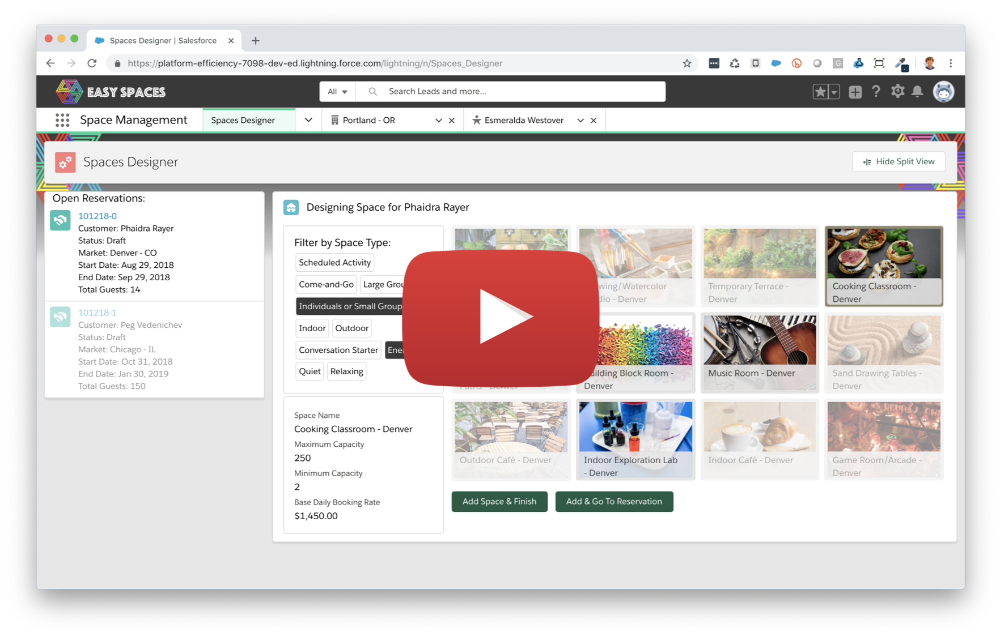

# Easy Spaces Lightning Web Components Sample Application

[](https://github.com/trailheadapps/easy-spaces-lwc/actions?query=workflow%3ACI) [](https://github.com/trailheadapps/easy-spaces-lwc/actions?query=workflow%3APackaging) [](https://codecov.io/gh/trailheadapps/easy-spaces-lwc)

> IMPORTANT: This is the new Lightning Web Components version of the Easy Spaces sample application. If you are looking for the Aura version, click [here](https://github.com/trailheadapps/easy-spaces).


Easy Spaces is a fictional event management company that creates and manages custom pop-up spaces for companies and individuals. Easy Spaces helps customers create temporary spaces like cafés, game rooms or themed rooms for special occasions in their offices and homes.

<div>
   
   <p style="padding-top:0.5em;">
      Learn more about this app by completing the <a href="https://trailhead.salesforce.com/en/content/learn/projects/quick-start-explore-the-easyspaces-sample-app" >Quick Start: Explore the Easy Spaces Sample App</a> Trailhead project.
   </p>
</div>

[](https://youtu.be/ZwvegTLx9kk)

> This sample application is designed to run on Salesforce Platform. If you want to experience Lightning Web Components on any platform, please visit https://lwc.dev, and try out our Lightning Web Components sample application [LWC Recipes OSS](https://github.com/trailheadapps/lwc-recipes-oss).

## Table of Contents

-   Installation Instructions

    -   [Installing Easy Spaces using a Scratch Org](#installing-easy-spaces-using-a-scratch-org)
    -   [Installing Easy Spaces using Unlocked Packages](#installing-easy-spaces-using-unlocked-packages)
    -   [Completing the Installation](#completing-the-installation)

-   [Optional installation instructions](#optional-installation-instructions)
-   [Features](#features)
-   [Code Highlights](#code-highlights)

## Installation Instructions

There are two ways to install Easy Spaces:

-   [Using a Scratch Org](#installing-easy-spaces-using-a-scratch-org): This is the recommended installation option. Use this option if you are a developer who wants to experience the app and the code.
-   [Using Unlocked Packages](#installing-easy-spaces-using-unlocked-packages): This option allows anybody to experience the sample app without installing a local development environment.

### Installing Easy Spaces using a Scratch Org

1. Set up your environment. Follow the steps in the [Quick Start: Lightning Web Components](https://trailhead.salesforce.com/content/learn/projects/quick-start-lightning-web-components/) Trailhead project. The steps include:

    - Enable Dev Hub in your Trailhead Playground
    - Install Salesforce CLI
    - Install Visual Studio Code
    - Install the Visual Studio Code Salesforce extensions, including the Lightning Web Components extension

1. If you haven't already done so, authenticate with your hub org and provide it with an alias (**myhuborg** in the command below):

    ```
    sfdx auth:web:login -d -a myhuborg
    ```

1. Clone this repository:

    ```
    git clone https://github.com/trailheadapps/easy-spaces-lwc
    cd easy-spaces-lwc
    ```

1. Create a scratch org and provide it with an alias (**easyspaces** in the command below):

    ```
    sfdx force:org:create -s -f config/project-scratch-def.json -a easyspaces
    ```

1. Push source to your scratch org:

    ```
    sfdx force:source:push
    ```

1. Assign two Easy Spaces permission sets to the default user:

    ```
    sfdx force:user:permset:assign -n EasySpacesObjects
    sfdx force:user:permset:assign -n SpaceManagementApp
    ```

1. (Optional) Assign the `Walkthroughs` permission set to the default user.

    > Note: this will enable your user to use In-App Guidance Walkthroughs, allowing you to be taken through a guided tour of the sample app. The Walkthroughs permission set gets auto-created with In-App guidance activation.

    ```
    sfdx force:user:permset:assign -n Walkthroughs
    ```

1. Import sample data:

    ```
    sfdx force:data:tree:import -p ./data/Plan1.json
    sfdx force:data:tree:import -p ./data/Plan2.json
    ```

1. Open the scratch org:

    ```
    sfdx force:org:open
    ```

1. In **Setup**, navigate to **Themes and Branding**

1. Activate the **Easy Spaces** theme

### Installing Easy Spaces using Unlocked Packages

Follow this set of instructions if you want to deploy the app to a more permanent environment than a Scratch org or if you don't want to install the local developement tools. You can use a non source-tracked orgs such as a free [Developer Edition Org](https://developer.salesforce.com/signup) or a [Trailhead Playground](https://trailhead.salesforce.com/).

Make sure to start from a brand-new environment to avoid conflicts with previous work you may have done.

1. Log in to your org

1. Click [this link](https://login.salesforce.com/packaging/installPackage.apexp?p0=04t4W000002Lm9QQAS) to install the **es-base-objects** package and choose **Install for All Users**.

1. Click [this link](https://login.salesforce.com/packaging/installPackage.apexp?p0=04t4W000002LmAOQA0) to install the **es-base-styles** package and choose **Install for All Users**.

1. Click [this link](https://login.salesforce.com/packaging/installPackage.apexp?p0=04t4W000002LmAJQA0) to install the **es-base-code** package and choose **Install for All Users**.

1. Click [this link](https://login.salesforce.com/packaging/installPackage.apexp?p0=04t4W000002Lm9kQAC) to install the **es-space-mgmt** package and choose **Install for All Users**.

1. From the command line, enter the following commands to clone this repository. You need to do this to get the metadata, code and files with sample data on your computer:

    ```
    git clone https://github.com/trailheadapps/easy-spaces-lwc
    cd easy-spaces-lwc
    ```

1. Assign EasySpacesObjects permission set by following below steps:

    - Go to **Setup > Users > Permission Sets**.
    - Click **EasySpacesObjects**.
    - Click **Manage Assignments**.
    - Click **Add Assignments**.
    - Select your username and click **Assign**.

1. Assign SpaceManagementApp permission set by following below steps:

    - Go to **Setup > Users > Permission Sets**.
    - Click **SpaceManagementApp**.
    - Click **Manage Assignments**.
    - Click **Add Assignments**.
    - Select your username and click **Assign**.

1. Import Lead data:

    - In **Setup**, type **Data Import** in the Quick Find box and click **Data Import Wizard**.
    - Click **Launch Wizard**.
    - Click the **Standard objects** tab, click **Leads**, and click **Add New Records**.
    - Drag **Lead_Data.csv** from the data folder of this project to the upload area.
    - Click **Next**, **Next**, and **Start Import**.

1. Import Contact data:

    - In **Setup**, type **Data Import** in the Quick Find box and click **Data Import Wizard**.
    - Click **Launch Wizard**.
    - Click the **Standard objects** tab, click **Accounts and Contacts**, and click **Add New Records**.
    - Drag **Contact_Data.csv** from the data folder of this project to the upload area.
    - Click **Next**, **Next**, and **Start Import**.

1. Import Market data:

    - In **Setup**, type **Data Import** in the Quick Find box and click **Data Import Wizard**.
    - Click **Launch Wizard**.
    - Click the **Custom objects** tab, click **Markets**, and click **Add New Records**.
    - Drag **Market_Data.csv** from the data folder of this project to the upload area.
    - Click **Next**, **Next**, and **Start Import**.

1. Import Spaces data:

    - In **Setup**, type **Data Import** in the Quick Find box and click **Data Import Wizard**.
    - Click **Launch Wizard**.
    - Click the **Custom objects** tab, click **Spaces**, and click **Add New Records**.
    - In the **Add New Records** menu, under _Which Market field in your file specifies the Master/Detail relationship?_ select **Market Name**
    - Drag **Space_Data.csv** from the data folder of this project to the upload area.
    - Click **Next**, **Next**, and **Start Import**.

1. In **Setup**, navigate to **Themes and Branding**

1. Activate the **Easy Spaces** theme

#### Explore the application

1. In **App Launcher**, click **View all** then select the **Space Management** app.

1. Note: Before trying to work with the Spaces Designer, use the **Reservation Manager** to draft a few reservations.

1. Have fun exploring!

## Optional Installation Instructions

This repository contains several files that are relevant if you want to integrate modern web development tooling to your Salesforce development processes, or to your continuous integration/continuous deployment processes.

### Code formatting

[Prettier](https://prettier.io/) is a code formatter used to ensure consistent formatting across your code base. To use Prettier with Visual Studio Code, install [this extension](https://marketplace.visualstudio.com/items?itemName=esbenp.prettier-vscode) from the Visual Studio Code Marketplace. The [.prettierignore](/.prettierignore) and [.prettierrc](/.prettierrc) files are provided as part of this repository to control the behavior of the Prettier formatter.

### Code linting

[ESLint](https://eslint.org/) is a popular JavaScript linting tool used to identify stylistic errors and erroneous constructs. To use ESLint with Visual Studio Code, install [this extension](https://marketplace.visualstudio.com/items?itemName=salesforce.salesforcedx-vscode-lwc) from the Visual Studio Code Marketplace. The [.eslintignore](/.eslintignore) file is provided as part of this repository to exclude specific files from the linting process in the context of Lighning Web Components development.

### Pre-commit hook

This repository also comes with a [package.json](./package.json) file that makes it easy to set up a pre-commit hook that enforces code formatting and linting by running Prettier and ESLint every time you `git commit` changes.

To set up the formatting and linting pre-commit hook:

1. Install [Node.js](https://nodejs.org) if you haven't already done so
1. Run `npm install` in your project's root folder to install the ESLint and Prettier modules (Note: Mac users should verify that Xcode command line tools are installed before running this command.)

Prettier and ESLint will now run automatically every time you commit changes. The commit will fail if linting errors are detected. You can also run the formatting and linting from the command line using the following commands (check out [package.json](./package.json) for the full list):

```
npm run lint
npm run prettier
```

## Features

A quick overview of the features you can explore in Easy Spaces:

-   Modular app design and Unlocked Packages
-   Lightning Console APIs & Background Refresh Methods
-   Salesforce Flow

    -   Dynamic flow interview components
    -   Custom flow screen components
    -   Local Action components

-   Custom Lightning Page Templates
-   Lightning Theming
-   Custom Metadata Types

## Code Highlights

### Dynamic Flows and Local Action Components

The **spaceDesigner** and **reservationHelper** Aura components render flow interviews dynamically, by using the **lightning:flow** base component. You can see the **reservationHelperForm** and **spaceDesignForm** Lightning web components at work as screens in these dynamic flows. Both of these components use **lightning\_\_FlowScreen** as the target in the component’s <targets> tag, and **FlowNavigationNextEvent** event from the **lightning/flowSupport** module to control flow navigation actions.

See this [blog post](https://developer.salesforce.com/blogs/2018/06/announcing-the-easy-spaces-app.html) for more detail about custom flow navigation and dynamic flow interviews.

These components used as Salesforce Flow screens also use a convention in the markup of their meta files, to help developers better track how properties are being used by flow interviews. See the [reservationHelperForm](./es-space-mgmt/main/default/lwc/reservationHelperForm/reservationHelperForm.js-meta.xml) and [spaceDesignForm](./es-space-mgmt/main/default/lwc/spaceDesignForm/spaceDesignForm.js-meta.xml) component meta files for examples.

### Object-Agnostic Design

The **customerList** and **customerTile** Lightning web components can display information from Contact objects or Lead objects. In the Reservation Manager app page, both Lead and Contact variations are used in order to create a unified workspace:


The customerList Lightning web component uses a design attribute to allow for users working in Lightning App Builder to control which object an instance of the Lightning web component should display:


This is just one example of object-agnostic design at work in Easy Spaces. See this [blog post](https://developer.salesforce.com/blogs/2018/06/announcing-the-easy-spaces-app.html) for more detail about this pattern.

### Console Navigation and Background Refresh

Easy Spaces uses the Lightning Console JavaScript API and the Lightning web component NavigationMixin to control user navigation between tabs and subtabs. You can see the lightning:workspaceAPI component at work in the **openRecordAction** Aura component, which enables flow interviews to navigate users to a new subtab. The **reservationHelperAura** and **spaceDesignerAura** components use the lightning:navigationItemAPI component to refresh custom Lightning Page tabs in the background as a user works. You can get more detail about using the Workspace API in your components in this [blog post](https://developer.salesforce.com/blogs/2018/06/announcing-the-easy-spaces-app.html).

Lightning web components use the NavigationMixin control navigation behavior. You can see the NavigationMixin at work in the [relatedSpaces](./es-space-mgmt/main/default/lwc/relatedSpaces/relatedSpaces.js), [customerTile](./es-space-mgmt/main/default/lwc/customerTile/customerTile.js) and [reservationTile](./es-space-mgmt/main/default/lwc/reservationTile/reservationTile.js) Lightning web components. The **customerList** and **reservationList** Lightning web components use Lightning Data Service wired methods to display data from Apex. This allows the platform to handle provisioning and managing a client-side cache. These components programmatically refresh that wired data, based on user interactions with sibling Aura components. Check out the code in [reservationList](./es-space-mgmt/main/default/lwc/reservationList/reservationList.js) and [customerList](./es-space-mgmt/main/default/lwc/customerList/customerList.js) Lightning web component Javascript files.

### Modular Design and Unlocked Packaging

Easy Spaces illustrates how to organize application metadata into granular units or modules. This approach is reflected in the design patterns at work throughout the application, like the use of object-agnostic components. But you'll also see this at work in the structure of the Easy Spaces repo itself.

The Easy Spaces application is made of several, interdependent unlocked packages. The dependecies between the Easy Spaces packages are listed in the [sfdx-project.json](./sfdx-project.json) file for this repo.

You can also explore the contents of each package by looking at the related package folder within this repo. The `path` attribute entries in the sfdx-project.json show which folder contains the metadata for a particular package.

For more about how the Easy Spaces metadata is organized into package modules, check out [this post](https://developer.salesforce.com/blogs/2018/06/working-with-modular-development-and-unlocked-packages-part-2.html).

## Code Tours

Code Tours are guided walkthroughs that will help you understand the app code better. To be able to run them, install the [CodeTour VSCode extension](https://marketplace.visualstudio.com/items?itemName=vsls-contrib.codetour).
